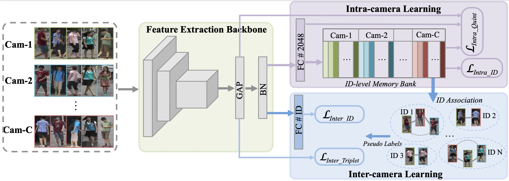

## Towards precise intra-camera supervised person re-identification

The official implementation for **Precise-ICS** ([Towards precise intra-camera supervised person re-identification](https://openaccess.thecvf.com/content/WACV2021/papers/Wang_Towards_Precise_Intra-Camera_Supervised_Person_Re-Identification_WACV_2021_paper.pdf)),  accepted to WACV 2021.



### Preparation

**Requirements: Pytorch>=1.1.0 and python>=3.6**

1. install [pytorch](https://pytorch.org/)
2. Download re-ID dataset 
   - [Market-1501](https://drive.google.com/file/d/0B8-rUzbwVRk0c054eEozWG9COHM/view)
   - [DukeMTMC-reID](https://drive.google.com/file/d/1jjE85dRCMOgRtvJ5RQV9-Afs-2_5dY3O/view)
   - [MSMT17](https://arxiv.org/abs/1711.08565)
3. Put the data under the dataset directory. Training, query and test sub-folder should named as bounding_box_train, query, bounding_box_test, respectively.

### Training and test model for Precise ICS

```python
# example: train Precise-ICS model on Market-1501
CUDA_VISIBLE_DEVICES=1 python train.py --log_path train_full_model.txt --save_model_interval 50 --dataset 'market1501' --market_path '/path/to/dataset/Market1501/' --associate_rate 1.5
```

Note: 

If necessary, you can manually set other hyper-parameters in the training script, such as T (for temperature) and miu (for updating rate) in memory bank learning.

Associate rate is set in the range of  [0.5, 1.5]  for better performance. In experiments we set 1.5 for Market-1501 and 1.0 for both DuekMTMC-ReID and MSMT17.